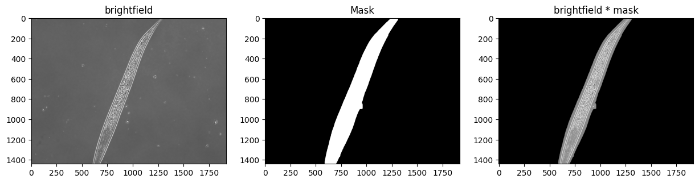
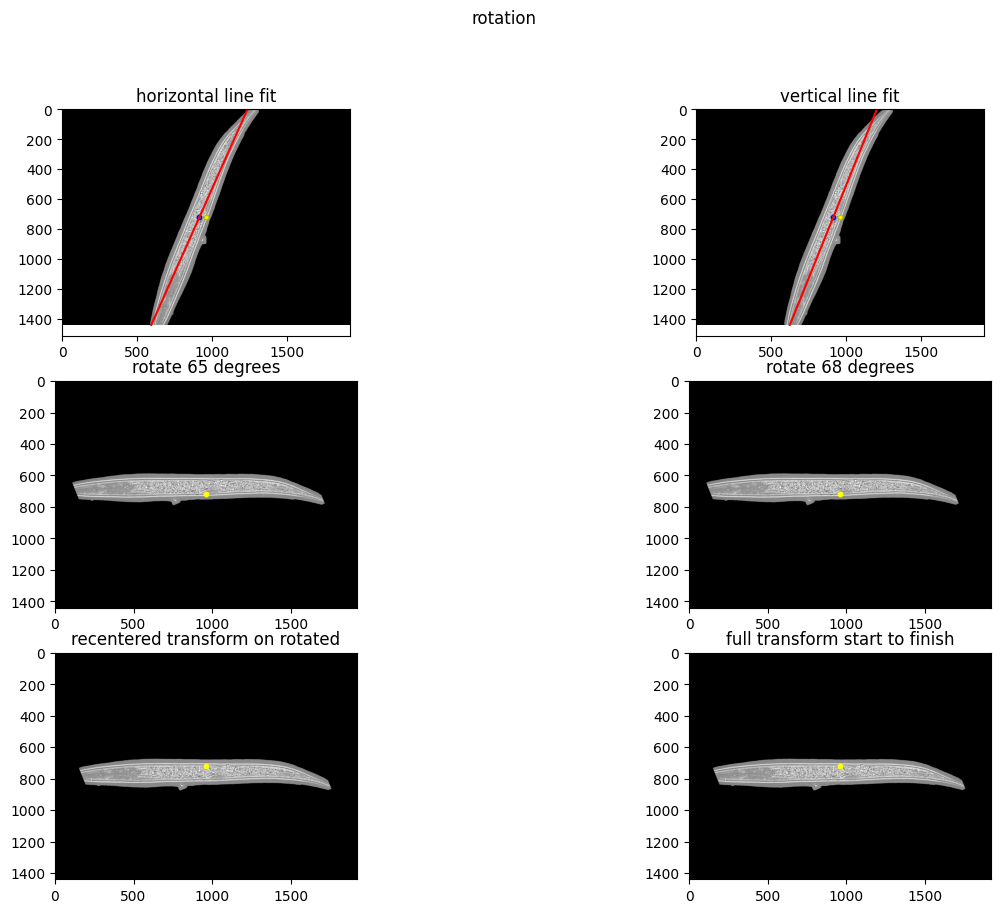
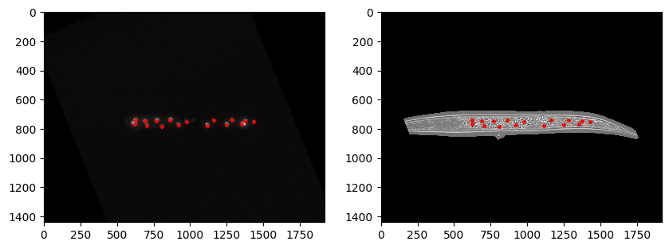

# Modeling *C. elegans* Transcription factor activity in nuclei

### Background and Significance:

&nbsp;&nbsp;&nbsp;&nbsp;&nbsp;Paralogous developmental transcription factors represent a theme throughout evolution of multicellular organisms called developmental system drift.  The system allows molecular plasticity during the specification and differentiation of tissues, providing a robust gene regulatory network that tolerates adaptation in the midst of highly criticial function that is strongly conserved at the basepair level.  In the development of cancer, these transcription factors often regain activity, and the developmental system is exploited by the process of oncogenesis.

&nbsp;&nbsp;&nbsp;&nbsp;&nbsp;The development of the *C. elegans* intestine offers a chance to study the dynamic of paralogous developmental transcription factors.  Organogenesis is completely  dependant on a primary transcription factor (ELT-2) for its development and function. However, regulation of that transcription factor may involve the action of other transcription factors, namely the paralog ELT-7.  This is indicated by reporter assays which suppress the action of the two.  The complementary, yet assymetric, roles of these TFs provide an examples of developmental robustness, and the molecular details of their interaction might provide insight into larger themes of developmental genome evolution.

### Scientific question:
The interaction of intestinal transcription factors appears to indicate an assymetric pattern of regulation.  Can the pattern of repression/activation be successfully modeled used stochastic process?

### Approach: 

Using segmentation and matplotlib image analysis, locate the nuclei in the *C. elegans* intestine and read the intensity of GFP reporters in different genetic backgrounds.

## Image analysis

The python notebook Copy_of_Segmentation_C_elegans_3D.ipynb performs masking (outline each worm), orientation (rotate to horizontal axis, mouth left), and segmentation (find spots).

### Masking

### Orientation

### Segmentation

### Data acquisition

The segmentation returns coordinates, areas, and intensities of pixels of each nucleus.  These values will be used in the modeling software SSIT.
